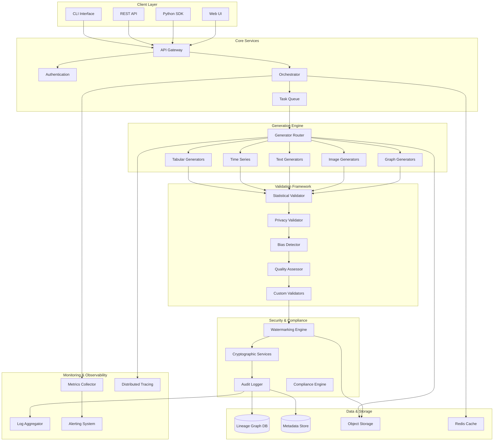
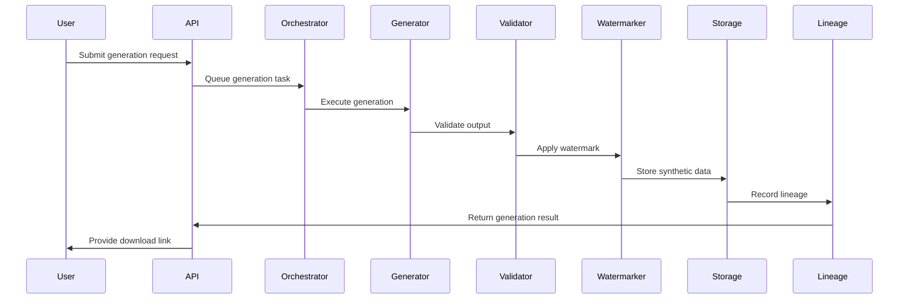

# Architecture: Synthetic Data Guardian

## Overview

The Synthetic Data Guardian is a comprehensive enterprise-grade platform for generating, validating, and managing synthetic data with built-in privacy protection, compliance reporting, and auditable lineage tracking.

## System Architecture



## Component Design

### 1. Generation Engine

#### Generator Router
- **Purpose**: Routes generation requests to appropriate backend engines
- **Responsibilities**:
  - Generator selection based on data type and configuration
  - Load balancing across multiple instances
  - Failure handling and fallback strategies
  - Resource allocation and quota management

#### Generator Backends
- **Tabular**: SDV (Gaussian Copula, CTGAN, TVAE), DataSynthesizer
- **Time Series**: DoppelGANger, TimeGAN, WaveGAN
- **Text**: GPT-3/4, Claude, T5, BERT-based models
- **Image**: Stable Diffusion, DALL-E, StyleGAN, VAE
- **Graph**: GraphVAE, NetGAN, GraphRNN

### 2. Validation Framework

#### Statistical Validator
```python
class StatisticalValidator:
    def validate(self, real_data, synthetic_data):
        return ValidationReport(
            ks_test_scores=self._ks_test(real_data, synthetic_data),
            wasserstein_distances=self._wasserstein(real_data, synthetic_data),
            correlation_matrices=self._correlation_analysis(real_data, synthetic_data),
            distribution_similarity=self._distribution_analysis(real_data, synthetic_data)
        )
```

#### Privacy Validator
```python
class PrivacyValidator:
    def validate(self, synthetic_data, attack_models=None):
        return PrivacyReport(
            reidentification_risk=self._linkage_attack(synthetic_data),
            membership_inference=self._membership_test(synthetic_data),
            attribute_inference=self._attribute_attack(synthetic_data),
            differential_privacy_score=self._dp_analysis(synthetic_data)
        )
```

### 3. Lineage Tracking

#### Graph Schema
```cypher
// Nodes
(:Dataset {id, name, path, schema, created_at})
(:Generator {name, version, parameters})
(:ValidationRun {id, results, timestamp})
(:Pipeline {id, name, configuration})
(:User {id, name, role})

// Relationships
(:Dataset)-[:GENERATED_BY]->(:Generator)
(:Dataset)-[:VALIDATED_BY]->(:ValidationRun)
(:Dataset)-[:CREATED_IN]->(:Pipeline)
(:Pipeline)-[:EXECUTED_BY]->(:User)
(:Dataset)-[:DERIVED_FROM]->(:Dataset)
```

### 4. Security Architecture

#### Watermarking System
- **Image Watermarking**: StegaStamp for invisible embedding
- **Data Watermarking**: Statistical fingerprinting in feature distributions
- **Verification**: Cryptographic proof of authenticity

#### Encryption Strategy
- **At Rest**: AES-256 for stored data and metadata
- **In Transit**: TLS 1.3 for all communications
- **Keys**: Hardware Security Module (HSM) integration

### 5. Data Flow Architecture



## Technology Stack

### Core Framework
- **Language**: Python 3.9+
- **Framework**: FastAPI for REST API
- **Task Queue**: Celery with Redis broker
- **Database**: PostgreSQL for metadata, Neo4j for lineage
- **Cache**: Redis for session and computation caching

### Generation Libraries
- **Tabular**: SDV, CTGAN, DataSynthesizer
- **Time Series**: DoppelGANger, TimeGAN
- **Text**: OpenAI API, Anthropic Claude API, HuggingFace Transformers
- **Image**: Stable Diffusion (diffusers), DALL-E API
- **Graph**: PyTorch Geometric, NetworkX

### Validation & Testing
- **Statistical**: SciPy, NumPy, pandas
- **Privacy**: differential-privacy library, custom re-identification tests
- **Testing**: pytest, hypothesis for property-based testing

### Infrastructure
- **Containerization**: Docker, docker-compose
- **Orchestration**: Kubernetes with Helm charts
- **Monitoring**: Prometheus, Grafana, Jaeger
- **CI/CD**: GitHub Actions, semantic-release

## Deployment Architecture

### Development Environment
```yaml
services:
  app:
    build: .
    ports: ["8080:8080"]
    environment:
      - DATABASE_URL=postgresql://user:pass@db:5432/synthetic_guardian
      - REDIS_URL=redis://redis:6379
      - NEO4J_URI=bolt://neo4j:7687
    depends_on: [db, redis, neo4j]
  
  db:
    image: postgres:15
    environment:
      POSTGRES_DB: synthetic_guardian
      POSTGRES_USER: user
      POSTGRES_PASSWORD: pass
  
  redis:
    image: redis:7-alpine
  
  neo4j:
    image: neo4j:5
    environment:
      NEO4J_AUTH: neo4j/password
```

### Production Deployment
- **Container Registry**: GitHub Container Registry
- **Orchestration**: Kubernetes with auto-scaling
- **Load Balancing**: NGINX Ingress Controller
- **Database**: Managed PostgreSQL and Neo4j instances
- **Storage**: S3-compatible object storage
- **Monitoring**: Prometheus stack with custom dashboards

## Security Considerations

### Threat Model
1. **Data Poisoning**: Malicious input affecting synthetic output
2. **Model Extraction**: Reverse engineering generation models
3. **Privacy Leakage**: Synthetic data revealing original patterns
4. **Watermark Removal**: Attempts to strip authenticity markers

### Mitigation Strategies
1. **Input Validation**: Comprehensive schema and content validation
2. **Rate Limiting**: API throttling and usage quotas
3. **Access Control**: RBAC with principle of least privilege
4. **Audit Logging**: Complete operation logging with integrity protection

## Performance Requirements

### Scalability Targets
- **Throughput**: 10,000 concurrent generation requests
- **Latency**: <500ms API response time (95th percentile)
- **Data Volume**: Support for datasets up to 100GB
- **Concurrent Users**: 1,000+ simultaneous users

### Optimization Strategies
- **Caching**: Multi-level caching (Redis, CDN, browser)
- **Compression**: Data compression for storage and transfer
- **Parallel Processing**: Multi-GPU support for generation
- **Streaming**: Large dataset streaming to reduce memory usage

## Monitoring and Observability

### Key Metrics
- **Business Metrics**: Generation success rate, data quality scores
- **Performance Metrics**: Response times, throughput, resource usage
- **Security Metrics**: Failed authentication attempts, anomalous access patterns
- **Reliability Metrics**: Error rates, availability, recovery times

### Alerting Strategy
- **Critical**: Service outages, security breaches, data corruption
- **Warning**: Performance degradation, quota approaching
- **Info**: Successful deployments, scheduled maintenance

## Future Architecture Considerations

### Planned Enhancements
1. **Federated Learning**: Distributed training across organizations
2. **Real-time Streaming**: Live synthetic data generation
3. **Multi-cloud**: Deployment across multiple cloud providers
4. **Edge Computing**: On-premises generation for sensitive data

### Extensibility Points
- **Plugin Architecture**: Custom generators and validators
- **API Versioning**: Backward compatibility for integrations
- **Configuration Management**: Dynamic configuration updates
- **Event Streaming**: Kafka integration for real-time events