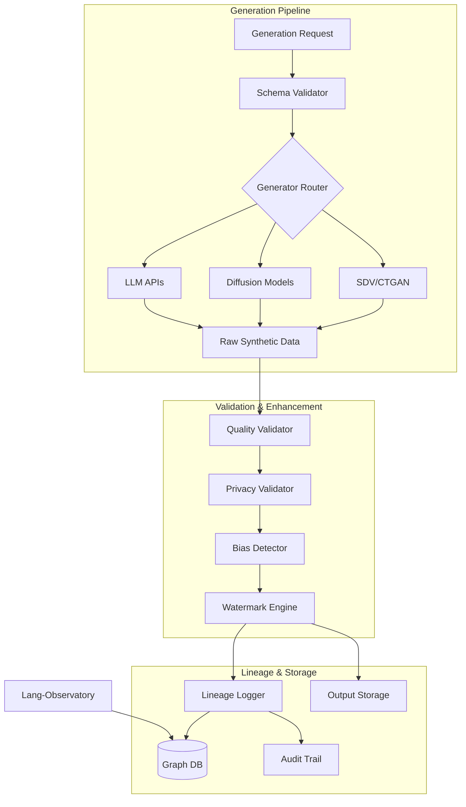

# synthetic-data-guardian

[](https://github.com/your-org/synthetic-data-guardian/actions)
[](LICENSE)
[](https://www.python.org/downloads/)
[](https://docs.your-org.com/synthetic-guardian)

Enterprise-grade synthetic data pipeline with built-in validation, watermarking, and auditable lineage tracking. Ensure regulatory compliance while leveraging synthetic data for AI development.

## 🎯 Key Features

- **Multi-Modal Generation**: Tabular, time-series, text, image, and graph data
- **Invisible Watermarking**: Cryptographic proof of synthetic origin
- **Verifiable Lineage**: Tamper-proof graph tracking from prompt to output
- **Privacy Validation**: Automated differential privacy and re-identification tests
- **Quality Assurance**: Statistical fidelity and distribution matching
- **Compliance Reports**: Auto-generated audit trails for regulators

## 📋 Table of Contents

- [Installation](#installation)
- [Quick Start](#quick-start)
- [Architecture](#architecture)
- [Data Types](#data-types)
- [Pipeline Configuration](#pipeline-configuration)
- [Validation Framework](#validation-framework)
- [Watermarking](#watermarking)
- [Lineage Tracking](#lineage-tracking)
- [API Reference](#api-reference)
- [Compliance](#compliance)
- [Contributing](#contributing)

## 🚀 Installation

### From PyPI

```bash
pip install synthetic-data-guardian
```

### With Optional Dependencies

```bash
# For all generation backends
pip install synthetic-data-guardian[all]

# Specific backends
pip install synthetic-data-guardian[tabular]  # SDV, CTGAN
pip install synthetic-data-guardian[vision]   # Stable Diffusion
pip install synthetic-data-guardian[text]     # GPT, Claude
pip install synthetic-data-guardian[graph]    # GraphVAE
```

### Docker Installation

```bash
docker run -it -p 8080:8080 \
  -v $(pwd)/data:/data \
  your-org/synthetic-guardian:latest
```

## ⚡ Quick Start

### Generate Validated Synthetic Data

```python
from synthetic_guardian import Guardian, GenerationPipeline

# Initialize guardian
guardian = Guardian()

# Create generation pipeline
pipeline = GenerationPipeline(
    name="customer_data_v1",
    description="Synthetic customer profiles for testing"
)

# Configure generation
pipeline.configure(
    generator="sdv",  # Synthetic Data Vault
    data_type="tabular",
    schema={
        "age": "integer[18:80]",
        "income": "float[20000:200000]",
        "email": "email",
        "purchase_history": "json"
    }
)

# Add validation steps
pipeline.add_validator("statistical_fidelity", threshold=0.95)
pipeline.add_validator("privacy_preservation", epsilon=1.0)
pipeline.add_validator("bias_detection", protected_attributes=["age"])

# Generate with full lineage tracking
result = guardian.generate(
    pipeline=pipeline,
    num_records=10000,
    seed=42
)

print(f"Generated {len(result.data)} records")
print(f"Quality score: {result.quality_score}")
print(f"Privacy score: {result.privacy_score}")
print(f"Lineage ID: {result.lineage_id}")
```

### Command Line Interface

```bash
# Generate from configuration
synthetic-guardian generate --config config.yaml --output data/

# Validate existing synthetic data
synthetic-guardian validate --input data/synthetic.csv --schema schema.json

# Track lineage
synthetic-guardian lineage --track-id abc123 --format graph

# Generate compliance report
synthetic-guardian report --data data/ --standard gdpr --output report.pdf
```

## 🏗️ Architecture



## 📊 Data Types

### Tabular Data

```python
# Using SDV for structured data
from synthetic_guardian.generators import TabularGenerator

generator = TabularGenerator(backend="sdv")
generator.fit(real_data_df)

synthetic_df = generator.generate(
    num_rows=1000,
    conditions={
        "country": "US",
        "age": ">= 18"
    }
)
```

### Time Series Data

```python
# Generate temporal patterns
from synthetic_guardian.generators import TimeSeriesGenerator

generator = TimeSeriesGenerator(
    backend="doppelganger",
    sequence_length=100,
    features=["price", "volume", "volatility"]
)

synthetic_ts = generator.generate(
    num_sequences=50,
    temporal_correlation=0.8
)
```

### Text Data

```python
# Generate synthetic text with privacy
from synthetic_guardian.generators import TextGenerator

generator = TextGenerator(
    backend="llm",
    model="gpt-4",
    privacy_mode="differential"
)

synthetic_docs = generator.generate(
    template="medical_notes",
    num_documents=100,
    pii_handling="redact"
)
```

### Image Data

```python
# Generate synthetic images with watermarks
from synthetic_guardian.generators import ImageGenerator

generator = ImageGenerator(
    backend="stable_diffusion",
    watermark=True
)

synthetic_images = generator.generate(
    prompt="chest x-ray, normal, frontal view",
    num_images=50,
    size=(512, 512)
)
```

### Graph Data

```python
# Generate synthetic network data
from synthetic_guardian.generators import GraphGenerator

generator = GraphGenerator(
    backend="graphvae",
    node_features=["type", "value"],
    edge_features=["weight", "timestamp"]
)

synthetic_graph = generator.generate(
    num_nodes=1000,
    avg_degree=5,
    community_structure=True
)
```

## ⚙️ Pipeline Configuration

### YAML Configuration

Create `pipeline_config.yaml`:

```yaml
pipeline:
  name: "financial_transactions_v2"
  description: "Synthetic financial data for fraud detection"
  
generation:
  backend: "ctgan"
  params:
    epochs: 300
    batch_size: 500
    pac: 10
    
  schema:
    transaction_id: "uuid"
    amount: "float[0.01:10000]"
    timestamp: "datetime"
    merchant_category: "categorical[retail,food,transport,utilities]"
    user_id: "integer"
    location: "geo_point"
    
validation:
  statistical_fidelity:
    enabled: true
    reference_data: "data/real_transactions.csv"
    metrics: ["ks_test", "wasserstein", "correlation"]
    threshold: 0.9
    
  privacy_preservation:
    enabled: true
    method: "differential_privacy"
    epsilon: 1.0
    delta: 1e-5
    
  bias_detection:
    enabled: true
    protected_attributes: ["merchant_category", "location"]
    fairness_metrics: ["demographic_parity", "equalized_odds"]
    
  outlier_detection:
    enabled: true
    contamination: 0.01
    method: "isolation_forest"
    
watermarking:
  enabled: true
  method: "stegastamp"
  strength: 0.8
  key: "${WATERMARK_KEY}"
  
lineage:
  backend: "neo4j"
  connection: "bolt://localhost:7687"
  retention_days: 365
  
output:
  format: "parquet"
  compression: "snappy"
  path: "s3://synthetic-data/financial/"
  
monitoring:
  export_to: "lang-observatory"
  metrics_interval: 60
```

### Programmatic Configuration

```python
from synthetic_guardian import PipelineBuilder

# Build pipeline programmatically
pipeline = (PipelineBuilder()
    .with_generator("ctgan", epochs=300)
    .with_schema({
        "user_id": "integer",
        "age": "integer[18:95]",
        "income": "float[0:1000000]",
        "credit_score": "integer[300:850]"
    })
    .add_validator("statistical_fidelity", threshold=0.95)
    .add_validator("privacy_preservation", epsilon=1.0)
    .add_watermark("stegastamp", strength=0.9)
    .with_lineage_tracking("neo4j")
    .build()
)
```

## 🔍 Validation Framework

### Statistical Fidelity

```python
from synthetic_guardian.validators import StatisticalValidator

validator = StatisticalValidator()
report = validator.validate(
    real_data=real_df,
    synthetic_data=synthetic_df,
    metrics=["ks_test", "wasserstein", "jensen_shannon"]
)

print(f"Overall fidelity: {report.overall_score:.2f}")
for column, score in report.column_scores.items():
    print(f"{column}: {score:.2f}")
```

### Privacy Preservation

```python
from synthetic_guardian.validators import PrivacyValidator

# Test for re-identification risk
privacy_validator = PrivacyValidator()
privacy_report = privacy_validator.validate(
    synthetic_data=synthetic_df,
    sensitive_columns=["ssn", "dob", "address"],
    attack_models=["linkage", "inference", "membership"]
)

print(f"Privacy score: {privacy_report.privacy_score:.2f}")
print(f"Re-identification risk: {privacy_report.reidentification_risk:.2%}")
```

### Bias Detection

```python
from synthetic_guardian.validators import BiasValidator

# Check for demographic bias
bias_validator = BiasValidator()
bias_report = bias_validator.validate(
    data=synthetic_df,
    protected_attributes=["gender", "race"],
    target="loan_approved",
    metrics=["demographic_parity", "equal_opportunity"]
)

for group, metrics in bias_report.group_metrics.items():
    print(f"{group}: DP={metrics.demographic_parity:.2f}")
```

## 🔏 Watermarking

### Invisible Watermarking for Images

```python
from synthetic_guardian.watermark import ImageWatermarker

watermarker = ImageWatermarker(method="stegastamp")

# Embed watermark
watermarked_image = watermarker.embed(
    image=synthetic_image,
    message="synthetic:guardian:v1:2024-01-15",
    key=secret_key
)

# Verify watermark
is_valid, message = watermarker.extract(
    image=watermarked_image,
    key=secret_key
)
print(f"Watermark valid: {is_valid}")
print(f"Message: {message}")
```

### Data Watermarking

```python
from synthetic_guardian.watermark import DataWatermarker

# Watermark tabular data
watermarker = DataWatermarker(method="statistical")
watermarked_df = watermarker.embed(
    data=synthetic_df,
    signature="org:dataset:v1",
    columns=["amount", "timestamp"]
)

# Verify data authenticity
is_authentic = watermarker.verify(
    data=watermarked_df,
    signature="org:dataset:v1"
)
```

## 📊 Lineage Tracking

### Setting Up Lineage Graph

```python
from synthetic_guardian.lineage import LineageTracker
from neo4j import GraphDatabase

# Initialize lineage tracker
tracker = LineageTracker(
    uri="bolt://localhost:7687",
    auth=("neo4j", "password")
)

# Track generation event
lineage_id = tracker.track_generation(
    pipeline_name="customer_profiles_v2",
    source_data="s3://raw-data/customers.csv",
    generator="sdv",
    parameters={
        "model": "gaussian_copula",
        "epochs": 100
    },
    output_path="s3://synthetic/customers_v2.parquet"
)
```

### Querying Lineage

```python
# Get full lineage graph
lineage = tracker.get_lineage(lineage_id)

# Find all synthetic data derived from a source
derivatives = tracker.find_derivatives(
    source="s3://raw-data/customers.csv"
)

# Audit trail for compliance
audit_trail = tracker.generate_audit_trail(
    dataset="customers_v2.parquet",
    format="pdf"
)
```

### Lineage Visualization

```python
# Generate interactive lineage graph
from synthetic_guardian.visualization import LineageVisualizer

visualizer = LineageVisualizer()
visualizer.plot_lineage(
    lineage_id=lineage_id,
    output="lineage_graph.html",
    include_metadata=True
)
```

## 📚 API Reference

### Core Classes

```python
class Guardian:
    def generate(self, pipeline: Pipeline, **kwargs) -> GenerationResult
    def validate(self, data: Any, validators: List[Validator]) -> ValidationReport
    def track_lineage(self, event: GenerationEvent) -> str
    
class GenerationPipeline:
    def configure(self, generator: str, **kwargs) -> None
    def add_validator(self, validator: str, **kwargs) -> None
    def add_watermark(self, method: str, **kwargs) -> None
    def run(self, num_samples: int) -> GenerationResult
    
class Validator(ABC):
    @abstractmethod
    def validate(self, data: Any, **kwargs) -> ValidationReport
    
class Watermarker(ABC):
    @abstractmethod
    def embed(self, data: Any, message: str) -> Any
    @abstractmethod
    def extract(self, data: Any) -> Tuple[bool, Optional[str]]
```

### REST API

```bash
# Start API server
synthetic-guardian serve --port 8080

# Generate synthetic data
POST /api/v1/generate
{
  "pipeline": "customer_profiles",
  "num_records": 10000,
  "format": "csv"
}

# Validate data
POST /api/v1/validate
{
  "data_url": "s3://bucket/data.csv",
  "validators": ["statistical", "privacy"],
  "reference_data": "s3://bucket/real.csv"
}

# Get lineage
GET /api/v1/lineage/{dataset_id}

# Generate compliance report
POST /api/v1/compliance/report
{
  "dataset": "dataset_id",
  "standard": "gdpr",
  "include_lineage": true
}
```

## 📋 Compliance

### GDPR Compliance

```python
from synthetic_guardian.compliance import GDPRReporter

reporter = GDPRReporter()
report = reporter.generate_report(
    synthetic_data=synthetic_df,
    generation_params=pipeline.params,
    lineage_id=lineage_id
)

# Report includes:
# - Data minimization proof
# - Purpose limitation documentation
# - Synthetic data quality metrics
# - Re-identification risk assessment
```

### HIPAA Compliance

```python
from synthetic_guardian.compliance import HIPAAReporter

# Generate HIPAA-compliant synthetic health data
hipaa_pipeline = PipelineBuilder()
    .with_generator("sdv")
    .with_hipaa_safe_harbor()  # Automatic de-identification
    .add_validator("hipaa_privacy")
    .build()

synthetic_health_data = guardian.generate(hipaa_pipeline)
```

### Custom Compliance Frameworks

```python
from synthetic_guardian.compliance import ComplianceFramework

# Define custom framework
custom_framework = ComplianceFramework(
    name="FinancialRegulation2024",
    requirements=[
        "data_retention_max_days=90",
        "encryption_at_rest=true",
        "audit_trail_required=true",
        "watermarking_mandatory=true"
    ]
)

# Validate compliance
is_compliant = custom_framework.validate(pipeline)
```

## 🤝 Contributing

We welcome contributions! Priority areas:
- New generator backends
- Additional validation metrics
- Watermarking algorithms
- Compliance frameworks

See [CONTRIBUTING.md](CONTRIBUTING.md) for guidelines.

### Development Setup

```bash
# Clone repository
git clone https://github.com/your-org/synthetic-data-guardian
cd synthetic-data-guardian

# Install with dev dependencies
poetry install --with dev

# Run tests
pytest tests/ -v

# Run compliance checks
python scripts/compliance_check.py
```

## 📄 License

This project is licensed under the Apache License 2.0 - see the [LICENSE](LICENSE) file for details.

## 🔗 Related Projects

- [Lang-Observatory](https://github.com/your-org/lang-observatory) - Monitoring dashboard
- [Privacy-Preserving-Finetuner](https://github.com/your-org/privacy-preserving-agent-finetuner) - Private model training
- [SDV](https://github.com/sdv-dev/SDV) - Synthetic Data Vault

## 📞 Support

- 📧 Email: synthetic-data@your-org.com
- 💬 Discord: [Join our community](https://discord.gg/your-org)
- 📖 Documentation: [Full docs](https://docs.your-org.com/synthetic-guardian)
- 🎓 Tutorial: [Synthetic Data Best Practices](https://learn.your-org.com/synthetic-data)
