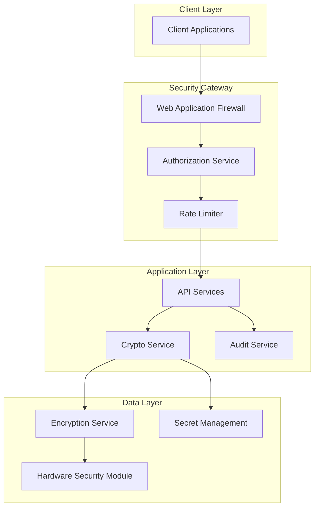

# ADR-0002: Security and Privacy Architecture

**Status**: Accepted  
**Date**: 2025-01-27  
**Deciders**: Security Team, Development Team  

## Context

Synthetic Data Guardian handles sensitive data and must provide strong security guarantees, privacy preservation, and regulatory compliance. We need to establish security patterns that protect data throughout the entire lifecycle.

## Decision

### 1. Zero-Trust Security Model
**Chosen**: Zero-trust architecture with explicit verification  
**Alternatives**: Perimeter-based security  
**Rationale**:
- No implicit trust based on network location
- Explicit verification for every access request
- Principle of least privilege enforcement
- Better protection against insider threats

### 2. Encryption Strategy
**Chosen**: AES-256 at rest, TLS 1.3 in transit  
**Alternatives**: AES-128, older TLS versions  
**Rationale**:
- AES-256 provides long-term cryptographic security
- TLS 1.3 removes vulnerable cipher suites
- Industry standard for sensitive data protection
- Forward secrecy with ephemeral key exchange

### 3. Watermarking for Data Authenticity
**Chosen**: Multi-modal watermarking (StegaStamp for images, statistical for tabular)  
**Alternatives**: Digital signatures only, blockchain-based provenance  
**Rationale**:
- Invisible watermarks don't affect data utility
- Cryptographic proof of synthetic origin
- Tamper detection capabilities
- Lower computational overhead than blockchain

### 4. Differential Privacy Implementation
**Chosen**: Customizable epsilon-delta differential privacy  
**Alternatives**: K-anonymity, L-diversity  
**Rationale**:
- Mathematical privacy guarantees
- Configurable privacy-utility tradeoff
- Composable across multiple queries
- Gold standard for privacy-preserving data release

### 5. Hardware Security Module (HSM) Integration
**Chosen**: HSM for key management and cryptographic operations  
**Alternatives**: Software-only key management  
**Rationale**:
- Hardware-based tamper resistance
- FIPS 140-2 Level 3 compliance capability
- Secure key generation and storage
- Non-repudiation for cryptographic operations

## Security Architecture



## Privacy Implementation

### Data Minimization
```python
class DataMinimizer:
    def minimize_schema(self, schema: DataSchema, purpose: str) -> DataSchema:
        """Remove unnecessary fields based on stated purpose"""
        necessary_fields = self.get_necessary_fields(purpose)
        return schema.filter(necessary_fields)
    
    def apply_k_anonymity(self, data: DataFrame, k: int = 5) -> DataFrame:
        """Ensure k-anonymity for quasi-identifiers"""
        return self.generalize_and_suppress(data, k)
```

### Differential Privacy
```python
class DifferentialPrivacyEngine:
    def add_noise(self, data: np.ndarray, epsilon: float, 
                  delta: float = 1e-5) -> np.ndarray:
        """Add calibrated noise for differential privacy"""
        sensitivity = self.calculate_sensitivity(data)
        noise_scale = sensitivity / epsilon
        return data + np.random.laplace(0, noise_scale, data.shape)
```

## Access Control Matrix

| Role | Generate | Validate | View Lineage | Admin Config | Export Data |
|------|----------|----------|--------------|--------------|-------------|
| Data Scientist | ✓ | ✓ | ✓ | ✗ | ✓ |
| Privacy Officer | ✗ | ✓ | ✓ | ✓ | ✗ |
| Administrator | ✓ | ✓ | ✓ | ✓ | ✓ |
| Auditor | ✗ | ✗ | ✓ | ✗ | ✗ |
| API User | ✓ | ✓ | ✗ | ✗ | ✓ |

## Compliance Framework

### GDPR Compliance
- **Data Protection by Design**: Privacy-preserving defaults
- **Purpose Limitation**: Clear purpose specification for all processing
- **Data Minimization**: Only necessary data fields processed
- **Consent Management**: Explicit consent tracking and withdrawal
- **Right of Erasure**: Secure deletion of personal data

### HIPAA Compliance
- **Safe Harbor Method**: Automatic de-identification of 18 identifiers
- **Expert Determination**: Statistical disclosure risk assessment
- **Access Controls**: Role-based access with audit trails
- **Breach Notification**: Automated incident response procedures

## Security Monitoring

### Threat Detection
```python
class SecurityMonitor:
    def detect_anomalies(self, access_patterns: List[AccessEvent]) -> List[Threat]:
        """Detect unusual access patterns"""
        return [
            self.detect_privilege_escalation(access_patterns),
            self.detect_data_exfiltration(access_patterns),
            self.detect_brute_force(access_patterns)
        ]
    
    def validate_watermarks(self, synthetic_data: Any) -> ValidationResult:
        """Verify data authenticity via watermarks"""
        return self.watermark_engine.verify(synthetic_data)
```

### Audit Requirements
- **Complete Audit Trail**: All operations logged with cryptographic integrity
- **Tamper-proof Logging**: Immutable log storage with digital signatures
- **Real-time Monitoring**: Immediate alerts for security violations
- **Compliance Reporting**: Automated generation of regulatory reports

## Key Management

### Key Hierarchy
1. **Master Key**: Stored in HSM, rarely accessed
2. **Data Encryption Keys**: Encrypted with master key, rotated monthly
3. **Session Keys**: Ephemeral keys for temporary operations
4. **Watermark Keys**: Long-lived keys for authenticity verification

### Key Rotation Policy
- **Master Keys**: Annual rotation or on compromise
- **Data Keys**: Monthly rotation with gradual migration
- **Session Keys**: Per-session generation and destruction
- **API Keys**: Quarterly rotation with overlap period

## Consequences

### Positive
- Strong cryptographic protection for sensitive data
- Mathematical privacy guarantees with differential privacy
- Comprehensive audit trail for compliance
- Tamper-evident watermarking for authenticity
- Defense-in-depth security architecture

### Negative
- Increased complexity in key management
- Performance overhead from encryption operations
- Higher infrastructure costs for HSM integration
- Potential usability impact from strict access controls

### Risk Mitigation
- Automated key rotation and backup procedures
- Performance optimization through hardware acceleration
- Gradual HSM rollout with fallback mechanisms
- User training and documentation for security procedures

## Implementation Timeline

1. **Phase 1**: Basic encryption and authentication (Week 1-2)
2. **Phase 2**: Differential privacy and watermarking (Week 3-4)
3. **Phase 3**: HSM integration and advanced monitoring (Week 5-6)
4. **Phase 4**: Compliance automation and reporting (Week 7-8)