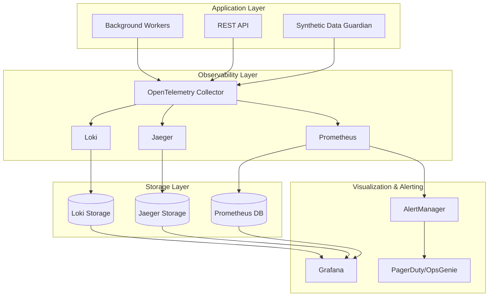

# Advanced Observability Stack

## Overview
This document outlines the comprehensive observability stack for the Synthetic Data Guardian project, implementing monitoring, logging, tracing, and alerting appropriate for enterprise synthetic data operations.

## Architecture



## OpenTelemetry Integration

### 1. Application Instrumentation

```typescript
// src/telemetry/instrumentation.ts
import { NodeSDK } from '@opentelemetry/sdk-node';
import { getNodeAutoInstrumentations } from '@opentelemetry/auto-instrumentations-node';
import { Resource } from '@opentelemetry/resources';
import { SemanticResourceAttributes } from '@opentelemetry/semantic-conventions';
import { PrometheusExporter } from '@opentelemetry/exporter-prometheus';
import { JaegerExporter } from '@opentelemetry/exporter-jaeger';
import { PeriodicExportingMetricReader } from '@opentelemetry/sdk-metrics';

// Initialize the SDK
const sdk = new NodeSDK({
  resource: new Resource({
    [SemanticResourceAttributes.SERVICE_NAME]: 'synthetic-data-guardian',
    [SemanticResourceAttributes.SERVICE_VERSION]: process.env.npm_package_version,
    [SemanticResourceAttributes.DEPLOYMENT_ENVIRONMENT]: process.env.NODE_ENV,
  }),
  instrumentations: [
    getNodeAutoInstrumentations({
      '@opentelemetry/instrumentation-fs': {
        enabled: false, // Disable file system instrumentation for security
      },
    }),
  ],
  traceExporter: new JaegerExporter({
    endpoint: process.env.JAEGER_ENDPOINT || 'http://localhost:14268/api/traces',
  }),
  metricReader: new PeriodicExportingMetricReader({
    exporter: new PrometheusExporter({
      port: 9090,
      endpoint: '/metrics',
    }),
  }),
});

// Start the SDK
sdk.start();

export default sdk;
```

### 2. Custom Metrics Collection

```typescript
// src/telemetry/metrics.ts
import { metrics } from '@opentelemetry/api';
import { MeterProvider } from '@opentelemetry/sdk-metrics';

const meter = metrics.getMeter('synthetic-data-guardian');

// Business metrics
export const syntheticDataGenerationCounter = meter.createCounter('synthetic_data_generations_total', {
  description: 'Total number of synthetic data generations',
});

export const syntheticDataGenerationDuration = meter.createHistogram('synthetic_data_generation_duration_seconds', {
  description: 'Duration of synthetic data generation operations',
  boundaries: [0.1, 0.5, 1, 2, 5, 10, 30, 60, 120, 300],
});

export const validationFailuresCounter = meter.createCounter('validation_failures_total', {
  description: 'Total number of validation failures',
});

export const watermarkOperationsCounter = meter.createCounter('watermark_operations_total', {
  description: 'Total number of watermarking operations',
});

export const privacyScoreGauge = meter.createUpDownCounter('privacy_score', {
  description: 'Current privacy score of generated data',
});

// Infrastructure metrics
export const activeConnectionsGauge = meter.createUpDownCounter('active_connections', {
  description: 'Number of active database connections',
});

export const memoryUsageGauge = meter.createUpDownCounter('memory_usage_bytes', {
  description: 'Memory usage in bytes',
});

export const cpuUsageGauge = meter.createUpDownCounter('cpu_usage_percent', {
  description: 'CPU usage percentage',
});

// Security metrics
export const securityEventsCounter = meter.createCounter('security_events_total', {
  description: 'Total number of security events',
});

export const failedAuthenticationsCounter = meter.createCounter('failed_authentications_total', {
  description: 'Total number of failed authentication attempts',
});
```

### 3. Custom Tracing

```typescript
// src/telemetry/tracing.ts
import { trace, context, SpanStatusCode, SpanKind } from '@opentelemetry/api';

const tracer = trace.getTracer('synthetic-data-guardian');

export class TracingService {
  async traceDataGeneration<T>(
    operationName: string,
    operation: () => Promise<T>,
    attributes?: Record<string, string | number | boolean>
  ): Promise<T> {
    return tracer.startActiveSpan(
      operationName,
      {
        kind: SpanKind.SERVER,
        attributes: {
          'synthetic.operation.type': 'data_generation',
          ...attributes,
        },
      },
      async (span) => {
        try {
          const startTime = Date.now();
          const result = await operation();
          
          const duration = Date.now() - startTime;
          span.setAttributes({
            'synthetic.generation.duration_ms': duration,
            'synthetic.generation.success': true,
          });
          
          span.setStatus({ code: SpanStatusCode.OK });
          return result;
        } catch (error) {
          span.recordException(error as Error);
          span.setStatus({
            code: SpanStatusCode.ERROR,
            message: error instanceof Error ? error.message : 'Unknown error',
          });
          throw error;
        } finally {
          span.end();
        }
      }
    );
  }

  async traceValidation<T>(
    validationType: string,
    operation: () => Promise<T>,
    metadata?: Record<string, any>
  ): Promise<T> {
    return tracer.startActiveSpan(
      `validation.${validationType}`,
      {
        kind: SpanKind.INTERNAL,
        attributes: {
          'validation.type': validationType,
          'validation.metadata': JSON.stringify(metadata || {}),
        },
      },
      async (span) => {
        try {
          const result = await operation();
          span.setAttributes({
            'validation.success': true,
            'validation.result': JSON.stringify(result),
          });
          span.setStatus({ code: SpanStatusCode.OK });
          return result;
        } catch (error) {
          span.recordException(error as Error);
          span.setStatus({
            code: SpanStatusCode.ERROR,
            message: error instanceof Error ? error.message : 'Validation failed',
          });
          throw error;
        } finally {
          span.end();
        }
      }
    );
  }
}

export const tracingService = new TracingService();
```

## Prometheus Configuration

### 4. Prometheus Configuration

```yaml
# monitoring/prometheus/prometheus.yml
global:
  scrape_interval: 15s
  evaluation_interval: 15s
  external_labels:
    environment: production
    service: synthetic-data-guardian

rule_files:
  - "rules/*.yml"

alerting:
  alertmanagers:
    - static_configs:
        - targets:
          - alertmanager:9093

scrape_configs:
  # Application metrics
  - job_name: 'synthetic-data-guardian'
    static_configs:
      - targets: ['app:8080']
    metrics_path: '/metrics'
    scrape_interval: 10s
    scrape_timeout: 5s

  # Node exporter for system metrics
  - job_name: 'node-exporter'
    static_configs:
      - targets: ['node-exporter:9100']

  # Database metrics
  - job_name: 'postgres-exporter'
    static_configs:
      - targets: ['postgres-exporter:9187']

  # Redis metrics
  - job_name: 'redis-exporter'
    static_configs:
      - targets: ['redis-exporter:9121']

  # Container metrics
  - job_name: 'cadvisor'
    static_configs:
      - targets: ['cadvisor:8080']

  # Kubernetes metrics (if deployed on K8s)
  - job_name: 'kubernetes-pods'
    kubernetes_sd_configs:
      - role: pod
    relabel_configs:
      - source_labels: [__meta_kubernetes_pod_annotation_prometheus_io_scrape]
        action: keep
        regex: true
      - source_labels: [__meta_kubernetes_pod_annotation_prometheus_io_path]
        action: replace
        target_label: __metrics_path__
        regex: (.+)
```

### 5. Alerting Rules

```yaml
# monitoring/prometheus/rules/synthetic-data-guardian.yml
groups:
  - name: synthetic-data-guardian.rules
    rules:
      # Application health
      - alert: ApplicationDown
        expr: up{job="synthetic-data-guardian"} == 0
        for: 1m
        labels:
          severity: critical
          service: synthetic-data-guardian
        annotations:
          summary: "Synthetic Data Guardian application is down"
          description: "The Synthetic Data Guardian application has been down for more than 1 minute."

      # High error rate
      - alert: HighErrorRate
        expr: |
          (
            rate(http_requests_total{job="synthetic-data-guardian",status=~"5.."}[5m]) /
            rate(http_requests_total{job="synthetic-data-guardian"}[5m])
          ) > 0.05
        for: 5m
        labels:
          severity: warning
          service: synthetic-data-guardian
        annotations:
          summary: "High error rate detected"
          description: "Error rate is above 5% for the last 5 minutes."

      # High response time
      - alert: HighResponseTime
        expr: |
          histogram_quantile(0.95,
            rate(http_request_duration_seconds_bucket{job="synthetic-data-guardian"}[5m])
          ) > 2
        for: 5m
        labels:
          severity: warning
          service: synthetic-data-guardian
        annotations:
          summary: "High response time detected"
          description: "95th percentile response time is above 2 seconds."

      # Memory usage
      - alert: HighMemoryUsage
        expr: |
          (
            process_resident_memory_bytes{job="synthetic-data-guardian"} /
            node_memory_MemTotal_bytes
          ) > 0.8
        for: 10m
        labels:
          severity: warning
          service: synthetic-data-guardian
        annotations:
          summary: "High memory usage"
          description: "Memory usage is above 80% for more than 10 minutes."

      # Data generation failures
      - alert: DataGenerationFailures
        expr: |
          rate(synthetic_data_generations_total{status="failed"}[5m]) > 0.1
        for: 2m
        labels:
          severity: critical
          service: synthetic-data-guardian
        annotations:
          summary: "High data generation failure rate"
          description: "Data generation failure rate is above 10% for the last 5 minutes."

      # Privacy score degradation
      - alert: PrivacyScoreDegradation
        expr: privacy_score < 0.8
        for: 5m
        labels:
          severity: warning
          service: synthetic-data-guardian
        annotations:
          summary: "Privacy score below threshold"
          description: "Privacy score has been below 0.8 for more than 5 minutes."

      # Security events
      - alert: SecurityEvents
        expr: |
          rate(security_events_total[5m]) > 0.05
        for: 1m
        labels:
          severity: critical
          service: synthetic-data-guardian
        annotations:
          summary: "High rate of security events"
          description: "Security events rate is above 0.05 per second."

      # Failed authentication attempts
      - alert: FailedAuthentications
        expr: |
          rate(failed_authentications_total[5m]) > 0.1
        for: 2m
        labels:
          severity: warning
          service: synthetic-data-guardian
        annotations:
          summary: "High failed authentication rate"
          description: "Failed authentication rate is above 0.1 per second."
```

## Grafana Dashboards

### 6. Application Overview Dashboard

```json
{
  "dashboard": {
    "id": null,
    "title": "Synthetic Data Guardian - Overview",
    "tags": ["synthetic-data", "guardian"],
    "timezone": "UTC",
    "panels": [
      {
        "id": 1,
        "title": "Data Generation Rate",
        "type": "stat",
        "targets": [
          {
            "expr": "rate(synthetic_data_generations_total[5m])",
            "legendFormat": "Generations per second"
          }
        ],
        "fieldConfig": {
          "defaults": {
            "unit": "reqps",
            "min": 0
          }
        }
      },
      {
        "id": 2,
        "title": "Generation Success Rate",
        "type": "stat",
        "targets": [
          {
            "expr": "rate(synthetic_data_generations_total{status=\"success\"}[5m]) / rate(synthetic_data_generations_total[5m])",
            "legendFormat": "Success Rate"
          }
        ],
        "fieldConfig": {
          "defaults": {
            "unit": "percentunit",
            "min": 0,
            "max": 1
          }
        }
      },
      {
        "id": 3,
        "title": "Privacy Score",
        "type": "gauge",
        "targets": [
          {
            "expr": "privacy_score",
            "legendFormat": "Privacy Score"
          }
        ],
        "fieldConfig": {
          "defaults": {
            "min": 0,
            "max": 1,
            "thresholds": {
              "steps": [
                {"color": "red", "value": 0},
                {"color": "yellow", "value": 0.7},
                {"color": "green", "value": 0.8}
              ]
            }
          }
        }
      },
      {
        "id": 4,
        "title": "Generation Duration",
        "type": "graph",
        "targets": [
          {
            "expr": "histogram_quantile(0.50, rate(synthetic_data_generation_duration_seconds_bucket[5m]))",
            "legendFormat": "50th percentile"
          },
          {
            "expr": "histogram_quantile(0.95, rate(synthetic_data_generation_duration_seconds_bucket[5m]))",
            "legendFormat": "95th percentile"
          },
          {
            "expr": "histogram_quantile(0.99, rate(synthetic_data_generation_duration_seconds_bucket[5m]))",
            "legendFormat": "99th percentile"
          }
        ],
        "yAxes": [
          {
            "unit": "s",
            "min": 0
          }
        ]
      },
      {
        "id": 5,
        "title": "Validation Failures",
        "type": "graph",
        "targets": [
          {
            "expr": "rate(validation_failures_total[5m])",
            "legendFormat": "{{validation_type}}"
          }
        ],
        "yAxes": [
          {
            "unit": "reqps",
            "min": 0
          }
        ]
      }
    ],
    "time": {
      "from": "now-1h",
      "to": "now"
    },
    "refresh": "10s"
  }
}
```

### 7. Security Monitoring Dashboard

```json
{
  "dashboard": {
    "id": null,
    "title": "Synthetic Data Guardian - Security",
    "tags": ["security", "synthetic-data"],
    "panels": [
      {
        "id": 1,
        "title": "Security Events",
        "type": "graph",
        "targets": [
          {
            "expr": "rate(security_events_total[5m])",
            "legendFormat": "{{event_type}}"
          }
        ]
      },
      {
        "id": 2,
        "title": "Failed Authentication Attempts",
        "type": "stat",
        "targets": [
          {
            "expr": "rate(failed_authentications_total[5m])",
            "legendFormat": "Failed Auths/sec"
          }
        ]
      },
      {
        "id": 3,
        "title": "Watermark Operations",
        "type": "graph",
        "targets": [
          {
            "expr": "rate(watermark_operations_total[5m])",
            "legendFormat": "{{operation_type}}"
          }
        ]
      },
      {
        "id": 4,
        "title": "Data Access Patterns",
        "type": "heatmap",
        "targets": [
          {
            "expr": "rate(http_requests_total{endpoint=~\"/api/v1/data.*\"}[5m])",
            "legendFormat": "{{endpoint}}"
          }
        ]
      }
    ]
  }
}
```

## Log Management

### 8. Structured Logging Configuration

```typescript
// src/logging/logger.ts
import winston from 'winston';
import { ElasticsearchTransport } from 'winston-elasticsearch';

const logger = winston.createLogger({
  level: process.env.LOG_LEVEL || 'info',
  format: winston.format.combine(
    winston.format.timestamp(),
    winston.format.errors({ stack: true }),
    winston.format.json(),
    winston.format.printf(({ timestamp, level, message, ...meta }) => {
      return JSON.stringify({
        timestamp,
        level,
        message,
        service: 'synthetic-data-guardian',
        environment: process.env.NODE_ENV,
        version: process.env.npm_package_version,
        ...meta,
      });
    })
  ),
  defaultMeta: {
    service: 'synthetic-data-guardian',
    environment: process.env.NODE_ENV,
  },
  transports: [
    new winston.transports.Console({
      format: winston.format.combine(
        winston.format.colorize(),
        winston.format.simple()
      ),
    }),
    new winston.transports.File({
      filename: 'logs/error.log',
      level: 'error',
    }),
    new winston.transports.File({
      filename: 'logs/combined.log',
    }),
  ],
});

// Add Elasticsearch transport in production
if (process.env.NODE_ENV === 'production' && process.env.ELASTICSEARCH_URL) {
  logger.add(
    new ElasticsearchTransport({
      level: 'info',
      clientOpts: {
        node: process.env.ELASTICSEARCH_URL,
      },
      index: 'synthetic-data-guardian-logs',
    })
  );
}

export default logger;
```

## Docker Compose for Monitoring Stack

### 9. Complete Monitoring Stack

```yaml
# docker-compose.monitoring.yml
version: '3.8'

services:
  prometheus:
    image: prom/prometheus:v2.45.0
    container_name: prometheus
    command:
      - '--config.file=/etc/prometheus/prometheus.yml'
      - '--storage.tsdb.path=/prometheus'
      - '--web.console.libraries=/etc/prometheus/console_libraries'
      - '--web.console.templates=/etc/prometheus/consoles'
      - '--web.enable-lifecycle'
      - '--web.enable-admin-api'
    ports:
      - "9090:9090"
    volumes:
      - ./monitoring/prometheus:/etc/prometheus
      - prometheus_data:/prometheus
    networks:
      - monitoring

  grafana:
    image: grafana/grafana:10.0.0
    container_name: grafana
    ports:
      - "3000:3000"
    environment:
      - GF_SECURITY_ADMIN_PASSWORD=admin
      - GF_USERS_ALLOW_SIGN_UP=false
    volumes:
      - grafana_data:/var/lib/grafana
      - ./monitoring/grafana/provisioning:/etc/grafana/provisioning
      - ./monitoring/grafana/dashboards:/var/lib/grafana/dashboards
    networks:
      - monitoring

  jaeger:
    image: jaegertracing/all-in-one:1.47
    container_name: jaeger
    ports:
      - "16686:16686"
      - "14268:14268"
    environment:
      - COLLECTOR_OTLP_ENABLED=true
    networks:
      - monitoring

  loki:
    image: grafana/loki:2.9.0
    container_name: loki
    ports:
      - "3100:3100"
    volumes:
      - ./monitoring/loki:/etc/loki
    command: -config.file=/etc/loki/local-config.yaml
    networks:
      - monitoring

  promtail:
    image: grafana/promtail:2.9.0
    container_name: promtail
    volumes:
      - /var/log:/var/log
      - ./monitoring/promtail:/etc/promtail
    command: -config.file=/etc/promtail/config.yml
    networks:
      - monitoring

  alertmanager:
    image: prom/alertmanager:v0.25.0
    container_name: alertmanager
    ports:
      - "9093:9093"
    volumes:
      - ./monitoring/alertmanager:/etc/alertmanager
      - alertmanager_data:/alertmanager
    command:
      - '--config.file=/etc/alertmanager/alertmanager.yml'
      - '--storage.path=/alertmanager'
    networks:
      - monitoring

  node-exporter:
    image: prom/node-exporter:v1.6.0
    container_name: node-exporter
    ports:
      - "9100:9100"
    volumes:
      - /proc:/host/proc:ro
      - /sys:/host/sys:ro
      - /:/rootfs:ro
    command:
      - '--path.procfs=/host/proc'
      - '--path.rootfs=/rootfs'
      - '--path.sysfs=/host/sys'
      - '--collector.filesystem.mount-points-exclude=^/(sys|proc|dev|host|etc)($$|/)'
    networks:
      - monitoring

volumes:
  prometheus_data:
  grafana_data:
  alertmanager_data:

networks:
  monitoring:
    driver: bridge
```

This comprehensive observability stack provides enterprise-grade monitoring, logging, tracing, and alerting capabilities specifically tailored for synthetic data operations with strong security and compliance focus.