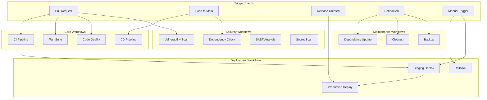

# 🔄 Comprehensive Workflow Guide

Complete guide for setting up GitHub Actions workflows for the Synthetic Data Guardian project.

## 📋 Table of Contents

- [Overview](#overview)
- [Workflow Architecture](#workflow-architecture)
- [Core Workflows](#core-workflows)
- [Security Workflows](#security-workflows)
- [Deployment Workflows](#deployment-workflows)
- [Maintenance Workflows](#maintenance-workflows)
- [Secrets Management](#secrets-management)
- [Environment Setup](#environment-setup)
- [Best Practices](#best-practices)
- [Troubleshooting](#troubleshooting)

## 🎯 Overview

The Synthetic Data Guardian project uses a comprehensive set of GitHub Actions workflows to ensure code quality, security, and reliable deployments. This guide provides detailed instructions for setting up and maintaining these workflows.

### Workflow Categories

1. **Core Workflows** - CI/CD, testing, and validation
2. **Security Workflows** - Vulnerability scanning, dependency checks
3. **Deployment Workflows** - Multi-environment deployment automation
4. **Maintenance Workflows** - Dependency updates, cleanup tasks

## 🏗️ Workflow Architecture



## 🔧 Core Workflows

### 1. Continuous Integration (CI)

**File**: `.github/workflows/ci.yml`

**Purpose**: Validates code quality and runs tests on every pull request.

**Key Features**:
- Multi-language support (Node.js, Python)
- Parallel test execution
- Code coverage reporting
- Security scanning integration

**Triggers**:
- Pull requests to main/staging branches
- Push to feature branches

**Setup Requirements**:
```yaml
# Required secrets
CODECOV_TOKEN: "codecov-upload-token"
SONAR_TOKEN: "sonarcloud-token"

# Required permissions
contents: read
security-events: write
pull-requests: write
```

### 2. Continuous Deployment (CD)

**File**: `.github/workflows/cd.yml`

**Purpose**: Automates deployment to staging and production environments.

**Key Features**:
- Blue-green deployments
- Automatic rollback on failure
- Health checks and smoke tests
- Deployment notifications

**Triggers**:
- Push to main branch (production)
- Push to staging branch (staging)
- Manual dispatch

### 3. Test Suite

**File**: `.github/workflows/test.yml`

**Purpose**: Comprehensive test execution across multiple environments.

**Test Types**:
- Unit tests (Jest, pytest)
- Integration tests
- End-to-end tests (Playwright)
- Performance tests (k6)
- Contract tests (Pact)

**Matrix Testing**:
```yaml
strategy:
  matrix:
    node-version: [16, 18, 20]
    python-version: [3.9, 3.10, 3.11]
    os: [ubuntu-latest, windows-latest, macos-latest]
```

## 🔒 Security Workflows

### 1. Vulnerability Scanning

**File**: `.github/workflows/security-scan.yml`

**Purpose**: Automated security vulnerability detection.

**Scanning Tools**:
- **Trivy**: Container and filesystem scanning
- **Snyk**: Dependency vulnerability scanning
- **CodeQL**: Static analysis security testing (SAST)
- **Semgrep**: Custom security rule enforcement

**Configuration Example**:
```yaml
- name: Run Trivy vulnerability scanner
  uses: aquasecurity/trivy-action@master
  with:
    scan-type: 'fs'
    scan-ref: '.'
    format: 'sarif'
    output: 'trivy-results.sarif'
    severity: 'CRITICAL,HIGH'
    exit-code: '1'
```

### 2. Dependency Security

**File**: `.github/workflows/dependency-check.yml`

**Purpose**: Monitors and reports on dependency vulnerabilities.

**Features**:
- Daily dependency vulnerability scans
- License compliance checking
- Automated security advisories
- SBOM (Software Bill of Materials) generation

### 3. Secret Scanning

**File**: `.github/workflows/secret-scan.yml`

**Purpose**: Prevents accidental secret commits.

**Tools**:
- **TruffleHog**: Git history secret scanning
- **GitLeaks**: Real-time secret detection
- **GitHub Secret Scanning**: Native GitHub protection

## 🚀 Deployment Workflows

### 1. Multi-Environment Deployment

**File**: `.github/workflows/deploy.yml`

**Environments**:
- **Development**: Feature branch deployments
- **Staging**: Integration testing environment
- **Production**: Live production environment

**Deployment Strategy**:
```yaml
strategy:
  environment:
    staging:
      deployment_method: rolling
      health_check_timeout: 300s
    production:
      deployment_method: blue_green
      health_check_timeout: 600s
      approval_required: true
```

### 2. Infrastructure as Code

**File**: `.github/workflows/infrastructure.yml`

**Purpose**: Manages infrastructure deployment and updates.

**Tools**:
- Terraform for infrastructure provisioning
- Ansible for configuration management
- Helm for Kubernetes deployments

### 3. Database Migrations

**File**: `.github/workflows/migrations.yml`

**Purpose**: Automated database schema migrations.

**Safety Features**:
- Pre-migration backups
- Migration validation
- Rollback procedures
- Zero-downtime migrations

## 🔄 Maintenance Workflows

### 1. Dependency Updates

**File**: `.github/workflows/dependency-update.yml`

**Purpose**: Automated dependency management.

**Update Types**:
- Security patches (automatic)
- Minor version updates (weekly)
- Major version updates (manual review)

**Process**:
1. Scan for outdated dependencies
2. Create update branches
3. Run test suites
4. Create pull requests for review

### 2. Cleanup Operations

**File**: `.github/workflows/cleanup.yml`

**Purpose**: Maintenance and cleanup tasks.

**Operations**:
- Remove old Docker images
- Clean up staging deployments
- Archive old logs
- Prune unused resources

### 3. Backup Workflows

**File**: `.github/workflows/backup.yml`

**Purpose**: Automated data backup and recovery.

**Backup Targets**:
- Database backups
- Configuration backups
- Monitoring data backups
- Code repository mirrors

## 🔐 Secrets Management

### Required Secrets

#### Authentication & Access
```bash
# GitHub and registry access
GITHUB_TOKEN: "github-personal-access-token"
GHCR_TOKEN: "github-container-registry-token"

# Cloud provider credentials
AWS_ACCESS_KEY_ID: "aws-access-key"
AWS_SECRET_ACCESS_KEY: "aws-secret-key"
GOOGLE_CREDENTIALS: "gcp-service-account-json"

# Kubernetes access
STAGING_KUBECONFIG: "base64-encoded-kubeconfig"
PRODUCTION_KUBECONFIG: "base64-encoded-kubeconfig"
```

#### External Services
```bash
# Monitoring and observability
GRAFANA_API_TOKEN: "grafana-api-token"
PROMETHEUS_URL: "prometheus-endpoint"
LANG_OBSERVATORY_TOKEN: "lang-observatory-token"

# Notification services
SLACK_WEBHOOK_URL: "slack-webhook-url"
PAGERDUTY_TOKEN: "pagerduty-integration-token"
EMAIL_SERVICE_API_KEY: "email-service-key"
```

#### Security Scanning
```bash
# Security scanning tools
SNYK_TOKEN: "snyk-api-token"
SONAR_TOKEN: "sonarcloud-token"
CODECOV_TOKEN: "codecov-upload-token"
TRIVY_TOKEN: "trivy-api-token"
```

#### Application Secrets
```bash
# Database connections
DATABASE_URL: "postgresql-connection-string"
REDIS_URL: "redis-connection-string"
NEO4J_URI: "neo4j-connection-string"

# API keys
OPENAI_API_KEY: "openai-api-key"
ANTHROPIC_API_KEY: "anthropic-api-key"

# Encryption keys
SECRET_KEY: "application-secret-key"
JWT_SECRET: "jwt-signing-secret"
WATERMARK_KEY: "data-watermarking-key"
```

### Secret Rotation

**File**: `.github/workflows/secret-rotation.yml`

**Purpose**: Automated secret rotation and validation.

**Rotation Schedule**:
- API keys: 90 days
- Database passwords: 60 days
- Encryption keys: 30 days
- Certificates: 30 days before expiry

## 🌍 Environment Setup

### Environment Configuration

#### Staging Environment
```yaml
environment:
  name: staging
  url: https://staging.synthetic-guardian.com
  variables:
    NODE_ENV: staging
    LOG_LEVEL: debug
    ENABLE_METRICS: true
  protection_rules:
    required_reviewers: 1
    wait_timer: 0
```

#### Production Environment
```yaml
environment:
  name: production
  url: https://synthetic-guardian.com
  variables:
    NODE_ENV: production
    LOG_LEVEL: info
    ENABLE_METRICS: true
  protection_rules:
    required_reviewers: 2
    wait_timer: 300  # 5 minutes
```

### Branch Protection Rules

```yaml
branch_protection:
  main:
    required_status_checks:
      - ci/tests
      - security/scan
      - quality/gate
    enforce_admins: true
    required_pull_request_reviews:
      required_approving_review_count: 2
      dismiss_stale_reviews: true
      require_code_owner_reviews: true
    restrictions:
      users: []
      teams: ["platform-team"]
```

## 📋 Best Practices

### Workflow Design

#### 1. Fail Fast Principle
```yaml
jobs:
  fast-checks:
    runs-on: ubuntu-latest
    steps:
      - name: Lint check
        run: npm run lint
      - name: Type check
        run: npm run typecheck
        
  slow-tests:
    needs: fast-checks
    runs-on: ubuntu-latest
    steps:
      - name: Integration tests
        run: npm run test:integration
```

#### 2. Parallel Execution
```yaml
jobs:
  test-node:
    runs-on: ubuntu-latest
    # Node.js tests
    
  test-python:
    runs-on: ubuntu-latest
    # Python tests
    
  test-frontend:
    runs-on: ubuntu-latest
    # Frontend tests
```

#### 3. Conditional Execution
```yaml
- name: Deploy to production
  if: github.ref == 'refs/heads/main' && github.event_name == 'push'
  run: ./deploy-production.sh
```

### Security Best Practices

#### 1. Least Privilege Access
```yaml
permissions:
  contents: read
  security-events: write
  pull-requests: write
```

#### 2. Secret Handling
```yaml
# ✅ Good
- name: Connect to database
  env:
    DATABASE_URL: ${{ secrets.DATABASE_URL }}
  run: ./connect-db.sh

# ❌ Bad - Never log secrets
- name: Debug connection
  run: echo "Connecting to ${{ secrets.DATABASE_URL }}"
```

#### 3. Artifact Security
```yaml
- name: Upload artifacts
  uses: actions/upload-artifact@v3
  with:
    name: test-results
    path: ./test-results/
    retention-days: 7  # Limit retention
```

### Performance Optimization

#### 1. Caching Strategies
```yaml
- name: Cache Node modules
  uses: actions/cache@v3
  with:
    path: ~/.npm
    key: ${{ runner.os }}-node-${{ hashFiles('**/package-lock.json') }}
    restore-keys: |
      ${{ runner.os }}-node-
```

#### 2. Matrix Optimization
```yaml
strategy:
  matrix:
    include:
      - os: ubuntu-latest
        node: 18
        python: 3.11
      - os: windows-latest
        node: 18
        python: 3.11
  fail-fast: false  # Continue other jobs if one fails
```

## 🔧 Troubleshooting

### Common Issues

#### 1. Workflow Timeout
```yaml
# Set appropriate timeouts
timeout-minutes: 30

# Or for specific steps
- name: Long running task
  timeout-minutes: 10
  run: ./long-task.sh
```

#### 2. Resource Limits
```yaml
# Use larger runners for resource-intensive tasks
runs-on: ubuntu-latest-4-cores

# Or self-hosted runners
runs-on: [self-hosted, linux, x64]
```

#### 3. Secret Access Issues
```bash
# Verify secret availability
- name: Check secrets
  run: |
    if [ -z "${{ secrets.DATABASE_URL }}" ]; then
      echo "DATABASE_URL secret not found"
      exit 1
    fi
```

### Debugging Workflows

#### 1. Enable Debug Logging
```yaml
env:
  ACTIONS_STEP_DEBUG: true
  ACTIONS_RUNNER_DEBUG: true
```

#### 2. Conditional Debugging
```yaml
- name: Debug on failure
  if: failure()
  run: |
    echo "Workflow failed, gathering debug info..."
    docker logs app-container
    kubectl describe pods -n staging
```

#### 3. Artifact Collection
```yaml
- name: Collect logs on failure
  if: failure()
  uses: actions/upload-artifact@v3
  with:
    name: failure-logs
    path: |
      logs/
      test-results/
      coverage/
```

### Monitoring Workflow Health

#### 1. Workflow Metrics
```yaml
- name: Report metrics
  run: |
    echo "workflow_duration_seconds{job=\"${{ github.job }}\"} ${{ github.workflow_run.duration }}" | \
    curl -X POST -H "Content-Type: text/plain" --data-binary @- \
    http://pushgateway:9091/metrics/job/github_actions
```

#### 2. Failure Notifications
```yaml
- name: Notify on failure
  if: failure()
  uses: 8398a7/action-slack@v3
  with:
    status: failure
    text: 'Workflow ${{ github.workflow }} failed in ${{ github.repository }}'
```

## 📚 Additional Resources

### Documentation
- [GitHub Actions Documentation](https://docs.github.com/en/actions)
- [Workflow Syntax Reference](https://docs.github.com/en/actions/reference/workflow-syntax-for-github-actions)
- [Security Hardening Guide](https://docs.github.com/en/actions/security-guides/security-hardening-for-github-actions)

### Tools and Actions
- [Awesome Actions](https://github.com/sdras/awesome-actions)
- [Action Marketplace](https://github.com/marketplace?type=actions)
- [Community Actions](https://github.com/actions)

### Security Resources
- [OpenSSF Scorecard](https://github.com/ossf/scorecard)
- [SLSA Framework](https://slsa.dev/)
- [Supply Chain Security](https://github.com/slsa-framework/slsa-github-generator)

## 🆘 Getting Help

### Internal Support
1. Check workflow logs in GitHub Actions tab
2. Review this documentation
3. Consult team runbooks
4. Create internal support ticket

### External Resources
1. GitHub Community Forum
2. Stack Overflow (github-actions tag)
3. GitHub Support (for enterprise customers)
4. Community Discord/Slack channels

### Contributing
When updating workflows:
1. Test in feature branch first
2. Update documentation
3. Get peer review
4. Monitor deployment carefully
5. Document any issues or improvements